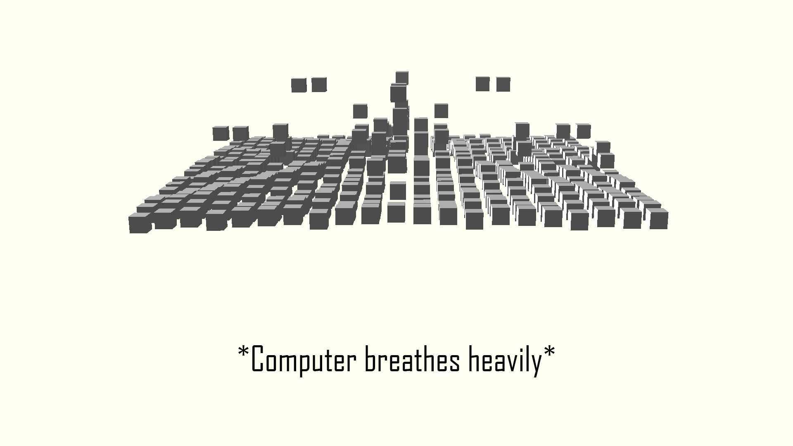
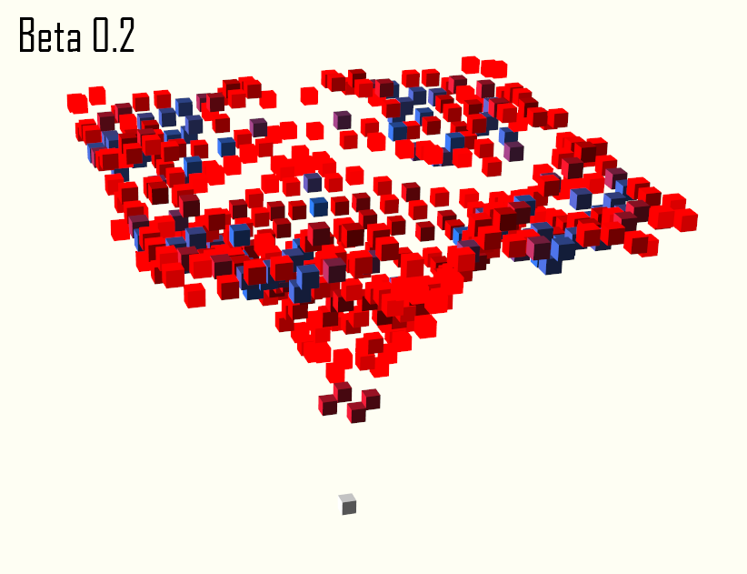
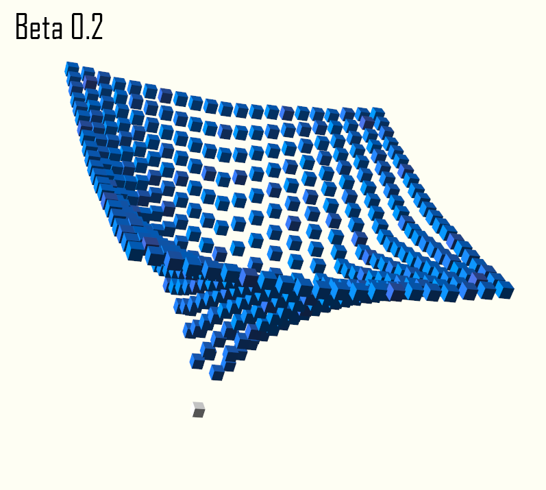

# Wave-simulator
A panda3d based wave-motion particle simulator in python.<br>
Customizable physical variables:<br>
```
MAINDIR = Filename.from_os_specific(os.getcwd())
RIGIDCONST=5
TIMESCALE=0.01
FRICTIONCONST=0.98 # 0.98 = Pizza dough, 0.90 = slow mo kevlar, 0.99 is too high, there is a major risk of structural instability
GLOBALSCALE=3
BLOCKINTERVAL=0.06
GLOBALMASS=0.1 # kg USI
```

### bounce_physics.py screenshots:



