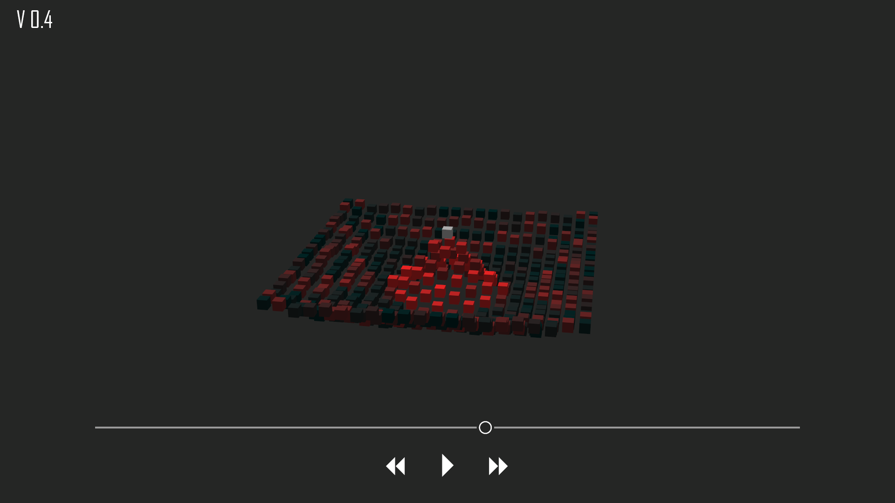

# Wave Engine
A panda3d powered wave-motion particle simulator in python.<br>

### Installing
The only required library is panda3d (all other libs used are included by default in the python installer package) <br>
In order to install it, type ```pip install panda``` in the windows command prompt, or install the SDK from [the panda3d webpage](panda3d.org)
Customizable physical variables inside the code:<br>
```python
RIGIDCONST = 4
TIMESCALE = 0.01
FRICTIONCONST = 0.98 # speed loss coefficient

GLOBALSCALE = 3
BLOCKINTERVAL = 0.06
GLOBALMASS = 0.1 # kg USI

HOLDING_FRAME = True # this defines whether there is a stable frame holding the moving surface or not. Try turning it off to see what happens 


TOGGLE_LIVE_DISPLAY = False # when switched off, the calculation process isn't rendered in 3d, and only returns a list of positions, which are transfered to the panda3d engine later, without doing the maths
PRESIMULATION_TIME = 200 # this is the amount of precomputed frames. Different computers may not need the same amount of time to read those frames, as they still need to be rendered in 3d
```

### Main algorithm screenshots

with their corresponding version (top left corner)

- **0.4 changelog**: added dark mode, improved user Gui, fixed some rendering bugs, and most importantly implemented precomputing, with two-window user interface

  This version is considered as stable


